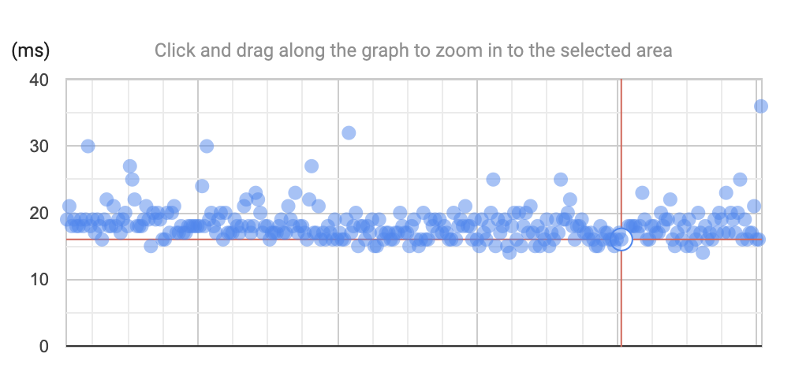
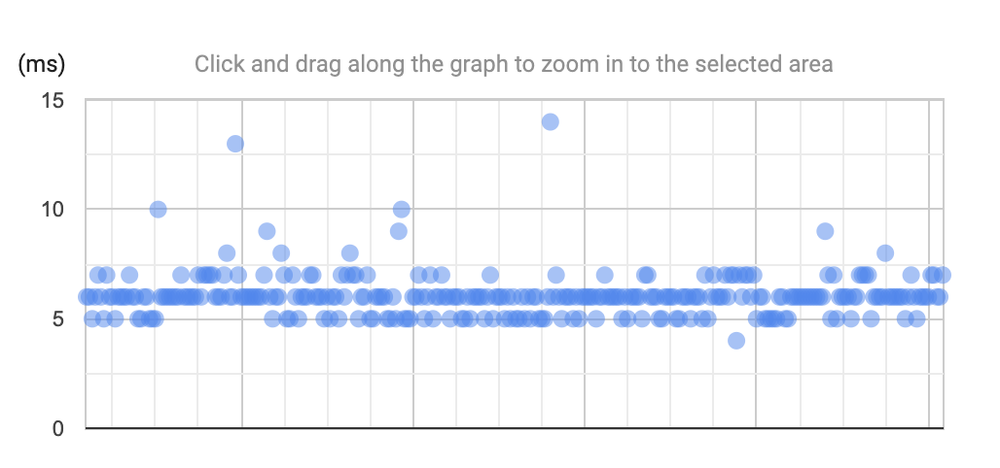
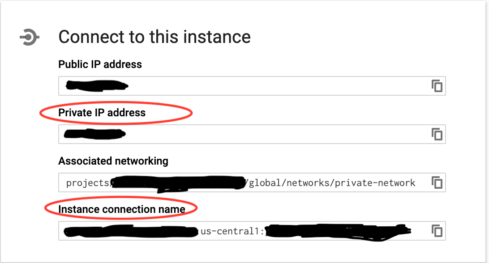

# Latency Comparison of Cloud SQL Connection

This repository compares latencies between connection via proxy and connection via private IP.

## Result

* Proxy
  * Min: At least 10ms
  * Avg: 20ms
  * Max: Around 40ms in this time span, but there can be peaks more than that with several reasons (ex. the credential of Cloud SQL is expired etc)



* Private IP
  * Min: At least 7ms
  * Avg: 7ms
  * Max: Around1 15ms in this time span, but there can be peaks more than that with several reasons (ex. a pod creation of the new SQL connection etc)



## Examine the results by yourself

### Requirements

* Create a GCP project: see [Creating and Managing Projects](https://cloud.google.com/resource-manager/docs/creating-managing-projects)
  * You can create a GCP project on browser or `gcloud projects create [Your Project ID]` if you already have `gcloud` on your machine.
* Billing is enabled for the project
* Install `gcloud`: see [Cloud SDK Quickstarts](https://cloud.google.com/sdk/docs/quickstarts)
* Install `kubectl`: see [Install and Set Up kubectl](https://kubernetes.io/docs/tasks/tools/install-kubectl/)

### Install and Update gcloud components

* `gcloud components update`
* `gcloud components install beta`

### Authentication

* `gcloud auth application-default login`
* `gcloud config set project [Your Project ID]`

## Enable services

```bash
./enable_services.sh
```

## Dockernize Flask container

```bash
cd flask-api
docker build -t gcr.io/[Your Project ID]/flask-api:latest .

gcloud auth configure-docker
docker push gcr.io/[Your Project ID]/flask-api:latest
```

## Terraform

* `cd terraform` to move the directory
* Install [tfenv](https://github.com/tfutils/tfenv)
* Run `tfenv install` to download terraform with version specified in `.terraform-version` file
* `terraform init`
* `terraform apply` and enter `[Your Project ID]` or `terraform apply -var-file=your.tfvars` something like this:

```your.tfvars
project = "[Your Project ID]"
```

## GKE

### Connect to cluster

```bash
gcloud container clusters get-credentials my-gke-cluster
```

### Create a service account as a secret

This step creates a service account to connect with Cloud SQL using proxy. If you want to use only Private IP connection, you can skip this step.

* SA NAME: Service Account Name
  * ex) proxy-db
* SA DISPLAY NAME: Service Display Name
  * ex) proxy-db

```bash
gcloud beta iam service-accounts create [SA NAME] \
 --display-name "[SA DISPLAY NAME]" \
 --project [Your Project ID]

gcloud projects add-iam-policy-binding [Your Project ID] \
   --member serviceAccount:[SA NAME]@[Your Project ID].iam.gserviceaccount.com \
   --role roles/cloudsql.admin

gcloud iam service-accounts keys create ./k8s/credentials.json \
   --iam-account [SA NAME]@[YOur Project ID].iam.gserviceaccount.com
```

Create a secret from credential file (json)

```bash
cd k8s
kubectl create secret generic cloudsql-instance-credentials --from-file=./credentials.json
```

### Deploy k8s with proxy

### Before deployment

Before deployment, replace the below values in `k8s_proxy.yaml`:

* [Your Project ID]: Your Project ID
* [INSTANCE_CONNECTION_NAME]: Your can check it on browser like below:



### Deploy

```bash
kubectl apply -f k8s_proxy.yaml
```

### Deploy k8s with private IP

### Before deployment

Before deployment, replace the below values in `k8s_private_ip.yaml`:

* [Your Project ID]: Your Project ID
* [DB_PRIVATE_IP]: Private IP address of your Cloud SQL Instance
* [ROOT_USER_PASSWORD]: Password for database root user
  * you can see it after you run `terraform apply` with something like this:

```bash
Apply complete! Resources: 0 added, 0 changed, 0 destroyed.

Outputs:

sql_password_root = [root user password]
```

#### Deploy

```bash
kubectl apply -f k8s_private_ip.yaml
```

### Stackdrive Trace

Access to Stackdriver Trace and now you can see latency!

## Caution

You may have to delete all the pods before applying new pods because of insufficient resources for the new pods. In that case, run the following command to delete all the pods before applying the new ones:

```bash
kubectl delete deployment test
```

## Clean up and don't waste your money!

Delete all the resources created by terraform

```bash
cd terraform
terraform destroy # and type [Your Project ID]
```

Or simply your can delete the GCP project

```bash
gcloud projects delete [Your Projecdt ID]
```
